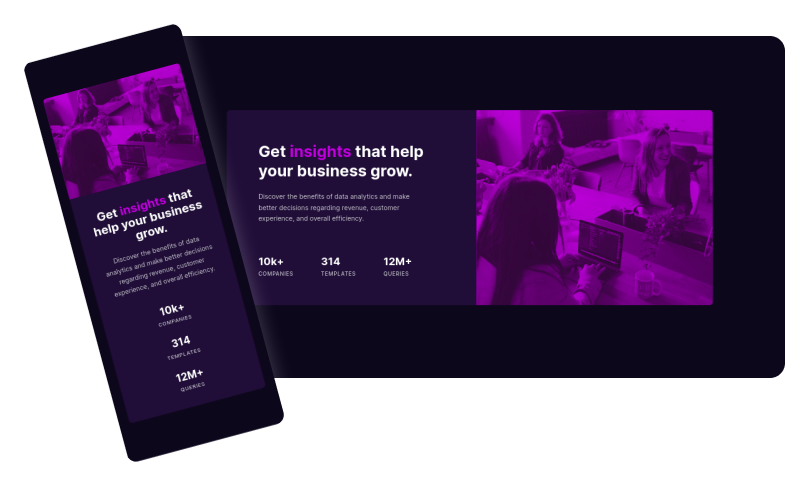

<br />
<p align="center">
  <a href="https://github.com/imfabra">
    
  </a>

  <h3 align="center">I'm Fabra - Front-end developer</h3>

  <p align="center">
    Web layout solution based on the design of Frontend Mentor
    <br />
    <a target="_blank" href="https://www.frontendmentor.io/solutions/stats-preview-card-component-solution-html5-css3-bem-QCrz6ndBt"><strong>View design»</strong></a>
    <br />
    <br />
    <a target="_blank" href="https://stats-preview-card-component-imfabra.vercel.app/">View Solution Demo</a>
    ·
    <a target="_blank" href="https://www.linkedin.com/in/danielj-fabra/">Contact Me</a>
    ·
    <a target="_blank" href="https://www.instagram.com/imfabra/">Follow Me</a>
  </p>
</p>
<br />
<br />


# Frontend Mentor - Stats preview card component solution

This is a solution to the [Stats preview card component challenge on Frontend Mentor](https://www.frontendmentor.io/challenges/stats-preview-card-component-8JqbgoU62). Frontend Mentor challenges help you improve your coding skills by building realistic projects. 

## Table of contents

- [Overview](#overview)
  - [The challenge](#the-challenge)
  - [Screenshot](#screenshot)
  - [Links](#links)
- [My process](#my-process)
  - [Built with](#built-with)
  - [What I learned](#what-i-learned)
- [Author](#author)

## Overview

### The challenge

Users should be able to:

- View the optimal layout depending on their device's screen size

### Screenshot




### Links

- Solution URL: [Solution URL](https://www.frontendmentor.io/solutions/stats-preview-card-component-solution-html5-css3-bem-QCrz6ndBt)
- Live Site URL: [Live site URL](https://stats-preview-card-component-imfabra.vercel.app/)

## My process

### Built with

- Semantic HTML5 markup
- CSS custom properties
- Flexbox
- Mobile-first workflow
- [BEM](https://en.bem.info/methodology/) - BEM methodology

### What I learned

With the development of this project I was able to learn to mix block contents, used to give the color of the image inside the card, the property I used was:

```css
.selector {
  mix-blend-mode: multiply;
}
```

Syntax:

```css
.selector {
  mix-blend-mode: normal;
  mix-blend-mode: multiply;
  mix-blend-mode: screen;
  mix-blend-mode: overlay;
  mix-blend-mode: darken;
  mix-blend-mode: lighten;
  mix-blend-mode: color-dodge;
  mix-blend-mode: color-burn;
  mix-blend-mode: hard-light;
  mix-blend-mode: soft-light;
  mix-blend-mode: difference;
  mix-blend-mode: exclusion;
  mix-blend-mode: hue;
  mix-blend-mode: saturation;
  mix-blend-mode: color;
  mix-blend-mode: luminosity;
}
```

**Note: for more information visit -> [mix-blend-mode](https://developer.mozilla.org/es/docs/Web/CSS/mix-blend-mode)**

## Author
- LinkedIn - [Daniel Fabra](https://www.linkedin.com/in/danielj-fabra/)
- Frontend Mentor - [@DanielFabra](https://www.frontendmentor.io/profile/DanielFabra)
- Instagram - [@imfabra](https://www.instagram.com/imfabra/)

